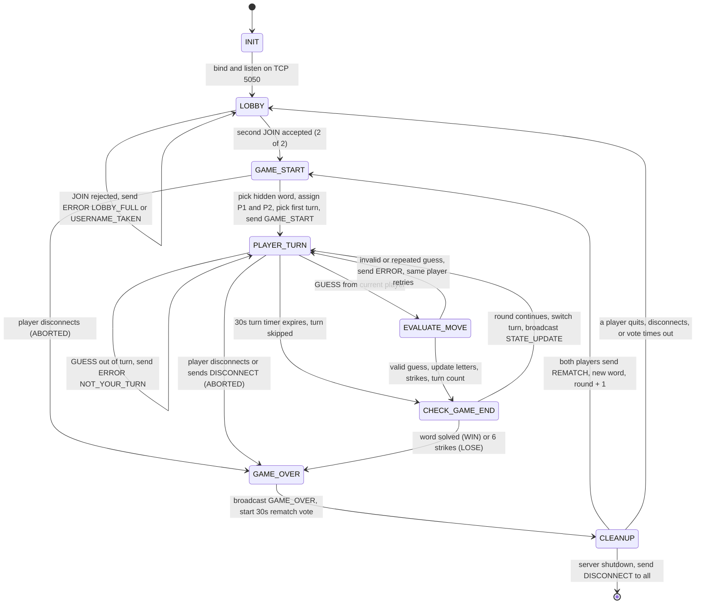
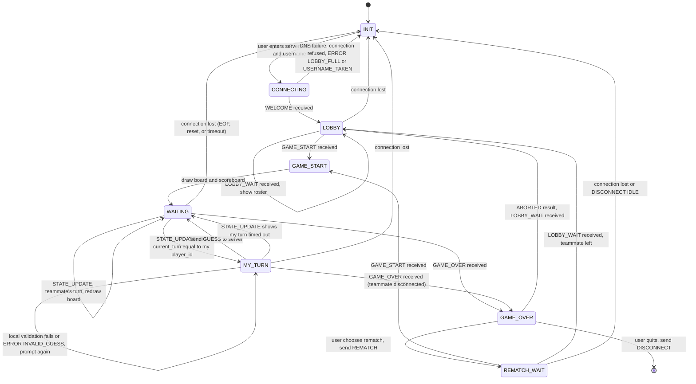

# CS 457 Sprint 1 — Game State Machine Specification

## 1. Server FSM Diagram

### Server state descriptions

| State | Description |
|---|---|
| INIT | Create listening socket, set `SO_REUSEADDR`, load word list |
| LOBBY | Accept connections and `JOIN`s until 2 players are seated |
| GAME_START | Choose word, assign Player 1 / Player 2, randomly choose first turn, broadcast `GAME_START` + initial `STATE_UPDATE` |
| PLAYER_TURN | Wait for `GUESS` from `current_turn` with a 30 s timer. Out-of-turn guesses get `ERROR NOT_YOUR_TURN` and change nothing |
| EVALUATE_MOVE | Validate guess format and repeats. Apply letter/word guess, add strike on miss |
| CHECK_GAME_END | Check solved / 6 strikes. Otherwise flip `current_turn` and broadcast `STATE_UPDATE` |
| GAME_OVER | Broadcast `GAME_OVER` with result, revealed word, and turn count |
| CLEANUP | Collect `REMATCH` votes. Drop non-voters, return survivors to LOBBY, or start a new round |

**Disconnects:** In co-op, a round can't continue with one player. A disconnect during any in-game state ends the round as `ABORTED` and the remaining player is returned to LOBBY after `GAME_OVER`. A disconnect in LOBBY just frees the seat.

## 2. Client-Side FSM

